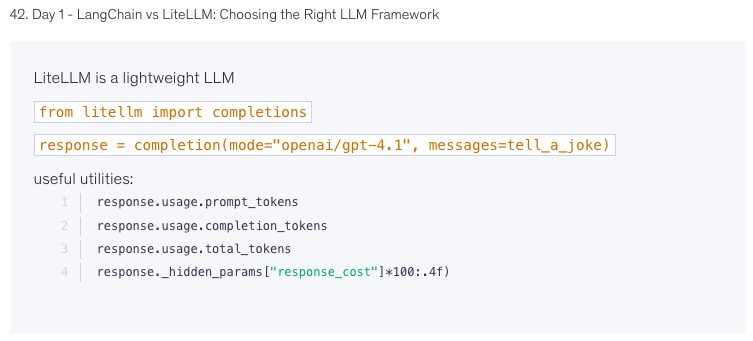
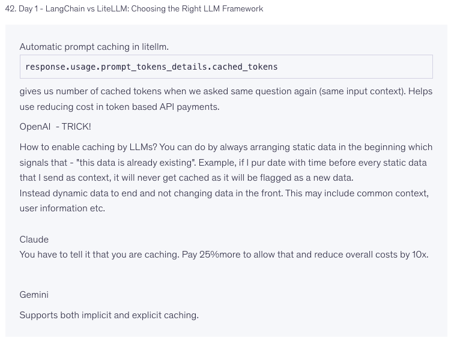
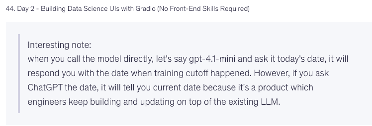
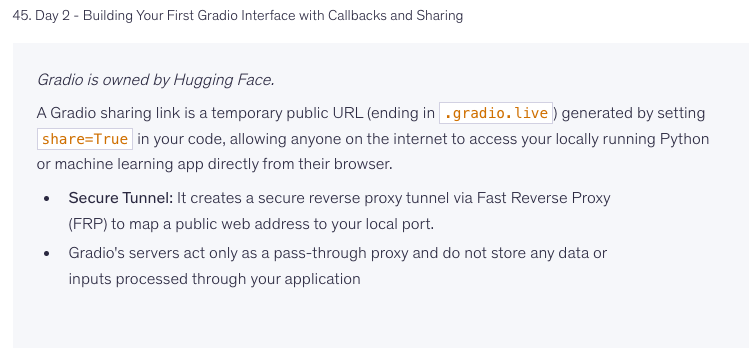
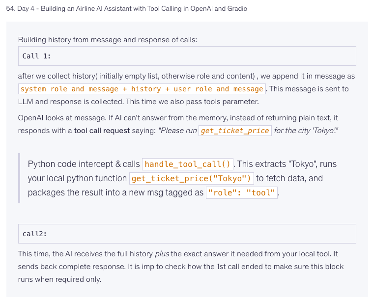
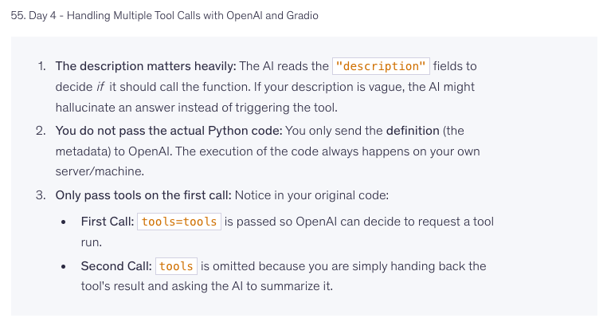
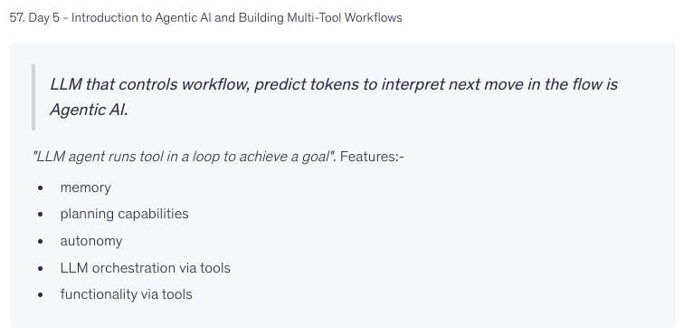

# LLM Application Development

APIs · LiteLLM · LangChain · Gradio · Tool Calling · Agentic AI

## Contents

1. [LLM API Fundamentals](#1-llm-api-fundamentals)
2. [LiteLLM](#2-litellm)
3. [LangChain vs LiteLLM](#3-langchain-vs-litellm)
4. [Tokens, Usage & API Cost](#4-tokens-usage--api-cost)
5. [Prompt Caching](#5-prompt-caching)
6. [LLM Knowledge vs AI Products](#6-llm-knowledge-vs-ai-products)
7. [Gradio](#7-gradio)
8. [Streaming LLM Responses](#8-streaming-llm-responses)
9. [Tool Calling](#9-tool-calling)
10. [Tool Calling Workflow](#10-tool-calling-workflow)
11. [Multiple Tool Calls](#11-multiple-tool-calls)
12. [Function Definition vs Function Execution](#12-function-definition-vs-function-execution)
13. [Agentic AI](#13-agentic-ai)
14. [LLM vs LLM Agent](#14-llm-vs-llm-agent)
15. [Multi-Tool / Agent Workflow](#15-multi-tool--agent-workflow)
16. [Quick Revision](#16-quick-revision)

---

## 1. LLM API Fundamentals

An application talks to a model over HTTP — send a request, get a response back. There's no persistent connection or session on the model's side.

**Request typically contains:**
- `model` — which model to call
- `messages` — the conversation so far
- `parameters` — temperature, max_tokens, top_p, etc.
- `tools` — optional function schemas the model can call

```python
response = client.chat.completions.create(
    model="gpt-4.1-mini",
    messages=messages
)
```

**Messages** — a conversation is an ordered list of role-tagged turns:

```python
messages = [
    {"role": "system", "content": "You are a helpful assistant."},
    {"role": "user", "content": "Explain RAG."}
]
```

| Role | Purpose |
|---|---|
| `system` | Sets behavior/instructions — highest-priority guidance |
| `user` | End-user input |
| `assistant` | Model's prior response (sent back for context) |
| `tool` | Result returned by a tool call |

**Stateless by default.** The model has no memory of Call 1 when Call 2 arrives — each request is self-contained. "Memory" in an LLM app is not a model feature; it's application logic that re-sends the growing message history on every call. This has a direct cost implication: a long conversation resends the entire history every turn, so token usage (and cost) grows with conversation length unless you truncate, summarize, or use RAG to compress older context.

---

## 2. LiteLLM
</img>

A unified client interface across LLM providers — same function call shape regardless of vendor.

```python
from litellm import completion

response = completion(
    model="openai/gpt-4.1",
    messages=messages
)
```

```
                 LiteLLM
                    │
       ┌────────────┼────────────┐
       ▼            ▼            ▼
    OpenAI       Anthropic     Gemini
```

**Response metadata** (provider-normalized):

```python
response.usage.prompt_tokens
response.usage.completion_tokens
response.usage.total_tokens
```

Used for cost estimation, usage monitoring, debugging, and token optimization.

**Why it matters:** without an abstraction layer, switching or A/B-testing providers means rewriting SDK-specific code (OpenAI SDK vs Anthropic SDK vs Gemini SDK) throughout the app. LiteLLM also supports model routing (e.g., fallback to a secondary model on failure/rate-limit) and cost tracking across providers in one place — useful once an app calls more than one model.

---

## 3. LangChain vs LiteLLM


**LiteLLM** — abstracts model/API access only.
```
Your Code → LiteLLM → LLM Provider
```
Good for: unified API, provider switching, routing, usage stats.

**LangChain** — a full framework for building LLM applications on top of a model.
```
Application → LangChain → { LLM · RAG · Tools · Agents }
```
Provides abstractions for prompts, models, chains, retrievers, tools, agents, and message/history management. (Its agent-orchestration layer has largely moved into **LangGraph**, a graph-based state machine for multi-step/agentic flows.)

**Key difference:**
- LiteLLM answers *"how do I call different LLMs?"*
- LangChain answers *"how do I build an application around LLMs?"*

They compose:
```
Application → LangChain → LiteLLM → LLM Provider
```

---

## 4. Tokens, Usage & API Cost

</img>

A model never sees raw words — text is tokenized first.

```
"Hello world" → Tokenizer → [token_1, token_2]
```

A token can be a whole word, part of a word, punctuation, or a whitespace pattern. Token boundaries are language- and tokenizer-specific — this is why non-English text or code often consumes more tokens per "word" than English prose.

**Three counts that matter:**

```python
response.usage.prompt_tokens       # sent to the model
response.usage.completion_tokens   # generated by the model
response.usage.total_tokens        # prompt + completion
```

**Why tokens matter:** they determine context usage, API cost (input and output tokens are usually billed at different rates — output is typically pricier), and latency (longer generations take longer, roughly linearly with completion tokens).

**Tokenizing directly:**

```python
import tiktoken

encoding = tiktoken.encoding_for_model("gpt-4.1-mini")
tokens = encoding.encode("hi there!")

for token_id in tokens:
    print(token_id, encoding.decode([token_id]))
```

**Context window** — the maximum tokens (input + output combined) a single request can hold:

```
┌ System Prompt ┐
│ History        │
│ Retrieved Docs │ → Context Window → LLM
│ Tool Results   │
│ Current Msg    │
└────────────────┘
```

Measured in tokens, not characters or words. Exceeding it either truncates silently (bad) or throws an error, depending on the API — always check remaining budget before appending large tool results or documents.

---
</img>

## 5. Prompt Caching

If every request repeats a large, unchanging block (system prompt, docs) followed by a small changing part (the user's question), reprocessing the static part every time is wasted compute.

```
Request 1:  Static Context → Full processing
Request 2:  Same Static Context → Cache hit → Lower cost, lower latency
```

**Checking cache usage:**

```python
response.usage.prompt_tokens_details.cached_tokens
```

**Ordering rule:** put stable content first, volatile content last — a cache is normally matched as a prefix, so anything that changes at the *start* of the prompt (like a timestamp) invalidates the cache for everything after it.

```
Bad:                          Good:
Current time: 10:31           Static instructions...
Static instructions...        Static documentation...
Static documentation...       Current time: 10:31
```

**Provider differences** (mechanism, not just pricing — check current docs before relying on specifics):
- OpenAI — automatic caching where supported, no code changes needed
- Anthropic — explicit cache-control breakpoints you set in the request; caches typically apply above a minimum block size
- Gemini — implicit and/or explicit caching depending on the API surface used

Caching is most valuable in RAG apps, coding assistants with large repo context, and any system reusing a big fixed instruction block across many calls.

---

## 6. LLM Knowledge vs AI Products

A raw model call and a finished AI product (e.g., ChatGPT) are not the same thing.

```
             AI Product
       ┌─────────┼─────────┐
     Model      Tools    Product Logic
```

A product wraps the model with capabilities the model doesn't have on its own:

```
LLM + Search + Tools + Memory + External Data
```

**Why this matters practically:** `Model ≠ AI Product`. A model's raw knowledge is frozen at training time; a product stays current by bolting on retrieval, tools, and memory around it — none of which require retraining the base model. When evaluating "is this model good," separate what's the base model's capability from what's the surrounding product engineering.

---

## 7. Gradio

</img>

A Python library for turning a function into a web UI with minimal code — no separate frontend needed.

```python
import gradio as gr

def generate(prompt):
    return model(prompt)

demo = gr.Interface(fn=generate, inputs="text", outputs="text")
demo.launch()
```

Good for prototypes, model testing, demos, and quick sharing.

**Sharing:**
```python
demo.launch(share=True)   # → https://xxxxx.gradio.live
```
This opens a temporary public tunnel to your locally running app. It is a **sharing mechanism, not a deployment mechanism** — the link expires and depends on your machine staying online; for production use a real hosting setup (e.g., Spaces, a container, a cloud VM).

---

## 8. Streaming LLM Responses

**Without streaming:** the client waits for the full generation, then receives it all at once.

**With streaming:** tokens are sent to the client as they're generated.

```python
stream = client.chat.completions.create(
    model="gpt-4.1-mini",
    messages=messages,
    stream=True
)

for chunk in stream:
    print(chunk)
```

The model still generates token-by-token internally either way — streaming only changes *when* the client is shown each piece. This matters for perceived latency (users see progress immediately instead of a blank wait) and for UX patterns like stop-generation buttons. It complicates client code slightly: you need to accumulate chunks, handle partial JSON if streaming structured/tool-call output, and handle stream interruption/errors mid-response.

---

## 9. Tool Calling

</img>

Lets a model request that an external function be run, instead of trying to answer from parameters alone.

```
User: "What is the ticket price to Tokyo?"
  → LLM: "I need get_ticket_price(Tokyo)"
    → Your backend runs get_ticket_price("Tokyo")
      → Tool result → LLM → "Ticket price is ₹..."
```

**Critical distinction:** the LLM never executes your code. It only outputs a structured request (tool name + arguments as JSON). Your application is responsible for parsing that request, running the actual function, and sending the result back.

```
LLM → Tool Call Request → Your Backend → Python Function → Tool Result → LLM
```

Because your backend executes it, you're responsible for validating arguments before running anything the model asked for — treat model-generated arguments like untrusted input, especially for tools that write, delete, spend money, or hit external APIs.

---

## 10. Tool Calling Workflow

**Call 1** — send system + user message + tool schemas. The model can't answer directly, so it returns a tool call instead of text:

```python
history = []
# ... system + user message sent with tools=[...]
```

Response contains something like `tool_calls: [{name: "get_ticket_price", arguments: '{"city": "Tokyo"}'}]` — arguments arrive as a JSON *string*, so parse it before use.

**Your app intercepts and executes:**

```python
import json

args = json.loads(tool_call.function.arguments)
city = args["city"]
result = get_ticket_price(city)
```

**Append the tool result** to history with the `tool` role (and the matching `tool_call_id`, so the model can associate result → request when multiple calls are in flight):

```python
history.append({"role": "tool", "tool_call_id": tool_call.id, "content": str(result)})
```

**Call 2** — resend the full history (system + user + assistant's tool call + tool result). The model now has what it needs to produce a final natural-language answer.

```
User → LLM → Tool needed?
              ├─ No  → Answer
              └─ Yes → Tool Request → App → Execute → Result → LLM → Answer
```


</img>

---

## 11. Multiple Tool Calls

A single model turn can request more than one tool at once when a task needs several independent pieces of information.

```
User: "Find the cheapest flight to Tokyo and today's weather there."
  → LLM requests: get_ticket_price("Tokyo"), get_weather("Tokyo")
```

```
              LLM
          /       \
   Flight Tool   Weather Tool
        │             │
     Result        Result
          \         /
              LLM
               │
          Final Answer
```

Your app should execute all requested calls (often in parallel, since they're usually independent) and append each result with its own `tool_call_id` before sending the next request — mismatched IDs are a common source of bugs in multi-tool flows.

</img>
</img>

---

## 12. Function Definition vs Function Execution

**The model receives only a schema**, not your code:

```python
{
    "name": "get_ticket_price",
    "description": "Get ticket price for a city",
    "parameters": {
        "type": "object",
        "properties": {"city": {"type": "string"}},
        "required": ["city"]
    }
}
```

It uses the `description` and `parameters` to decide *whether* to call the tool and *what arguments* to supply — description quality directly affects call accuracy, so vague descriptions produce vague/wrong tool usage.

**What it does NOT receive:** the actual function body. Implementation stays server-side.

```
LLM → Tool Schema → Tool Call Request → Your Backend → Actual Code → Result → LLM
```

---

## 13. Agentic AI

</img>


**Definition:** a system where the LLM decides what action to take next, observes the result, and decides the next action — repeated until the goal is met.

```
Goal → LLM → Choose Action → Tool → Observe Result → LLM → Next Action → ... → Done
```

> An agent runs tools in a loop to achieve a goal — the loop is the defining feature, not the presence of an LLM.

**Core components:**

| Component | Role |
|---|---|
| LLM | Reasoning and decision-making |
| Tools | Interaction with the outside world (search, DB, calculator, API, file system, code executor) |
| Memory | Information carried across steps |
| Planning | Breaking a goal into smaller actions |
| Orchestration | Deciding which action/node runs next |
| Autonomy | Choosing subsequent actions dynamically, not following a fixed script |

---

## 14. LLM vs LLM Agent

| LLM | Agent |
|---|---|
| Generates a response | Pursues a goal |
| Usually one inference call | Multiple inference/tool steps |
| No external action by default | Uses tools |
| Input → Output | Goal → Plan → Actions → Result |
| Stateless unless context is supplied | Maintains memory/state across steps |

**Example:**

Plain LLM: `"Weather in Delhi?"` → `"I don't have current weather data."`

Agent: `"Weather in Delhi?"` → calls weather tool → receives data → `"Delhi is currently..."`

The distinguishing factor is the **action + feedback loop**, not merely that an LLM is involved.

---

## 15. Multi-Tool / Agent Workflow

```
                 User Goal
                    │
                   LLM
          ┌─────────┼─────────┐
       Search    Database   Calculator
          └─────────┼─────────┘
                  Results
                    │
                   LLM
                    │
             Need another step?
               Yes │    │ No
                   LLM  Final Answer
```

**Agent loop (pseudocode):**

```python
while not goal_completed:
    response = llm(messages=history, tools=tools)

    if response.tool_call:
        result = execute_tool(response.tool_call)
        history.append(response)
        history.append(result)
    else:
        return response
```

**Safety controls — never let an agent loop unbounded:**

```
MAX_STEPS
MAX_TOOL_CALLS
TIMEOUT
TOKEN_LIMIT
ERROR_HANDLING (retries, fallback, graceful failure message)
```

```python
MAX_STEPS = 10
```

In production, also log every tool call/result pair — agent loops are hard to debug after the fact without a full trace of what was called, with what arguments, and what came back.

---

## 16. Summary

| Concept | Remember |
|---|---|
| LLM API | App ↔ model over HTTP, stateless per call |
| Messages | Structured, role-tagged conversation history |
| LiteLLM | One interface, many providers |
| LangChain | Framework for building LLM apps (prompts, chains, retrieval, agents) |
| Token | Smallest unit the model processes |
| Prompt/Completion Tokens | Sent vs generated — billed differently |
| Context Window | Max tokens per request (input + output) |
| Prompt Caching | Reuse static prefix content to cut cost/latency |
| Gradio | Fast Python-only UI for demos, not production hosting |
| Streaming | Progressive token delivery, better perceived latency |
| Tool Calling | Model requests a function; app executes it |
| Tool Definition | Schema only — no code sent to the model |
| Tool Execution | Always happens in your backend |
| Agent | LLM + tools + loop + goal |
| Memory | State persisted across agent steps |
| Planning | Deciding the sequence of actions |
| Orchestration | Controlling the workflow/routing |
| Autonomy | Agent picks next actions itself |
| Multi-Tool Agent | Coordinates several tools per task |

---

## Mental Model

```
                    AI APPLICATION
             ┌────────────┴────────────┐
           LLM                    Application
     ┌───────┼───────┐        ┌───────┼───────┐
  Prompt   Tools   Memory    APIs    DBs   Functions
     └───────┼───────┘        └───────┼───────┘
             └──────────┬──────────────┘
                   Agent Workflow
                         │
                   Final Result
```
