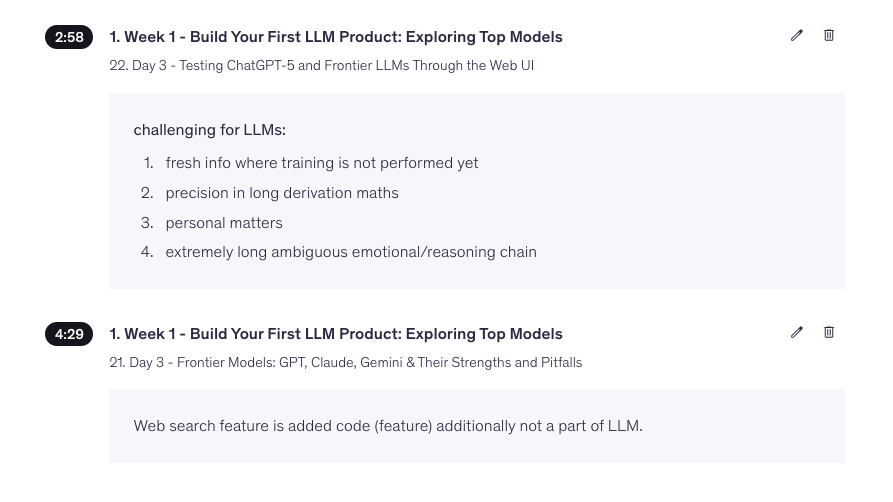
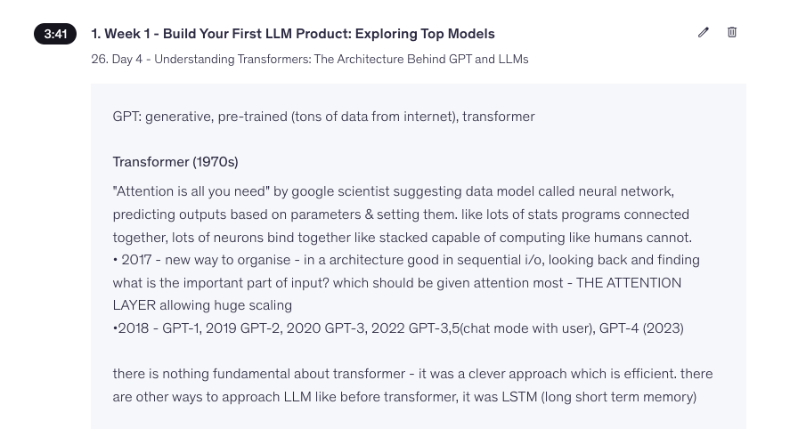
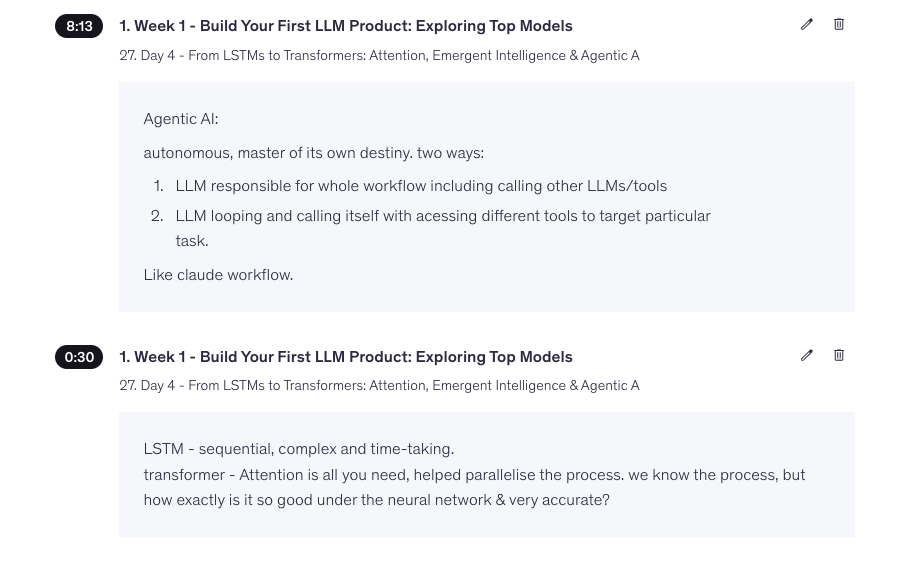
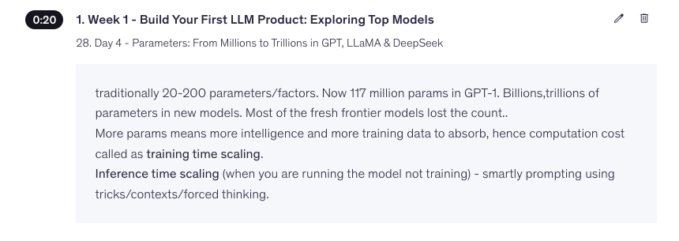

<div align="center">

# Build Your First LLM Product
### Part 1 · Foundations of Large Language Models

</div>

<br>

> **In this part**
> 
> `What LLMs Struggle With` · `Frontier Models` · `Foundation Models` · `GPT` · `LSTMs → Transformers` · `Tokens & Context` · `Building a Sales Brochure with an LLM`

<br>

---

## ⚠️ What LLMs Struggle With

<div align="center">

</div>

<br>

### 1. Hallucinations

An LLM will confidently generate information that *sounds* completely plausible but is actually false. The tricky part: the model has no real way to distinguish between an answer it's "confident" about and one that's actually correct — it's predicting likely-sounding text, not checking facts against reality.

**Tends to get worse when:**
| Trigger | Why |
|---|---|
| Missing knowledge | The model fills gaps with plausible-sounding guesses |
| Vague prompts | Underspecified asks leave room to improvise |
| Long reasoning chains | More steps = more room to drift off track |

**Mitigations:** `RAG` · `Tool Calling` · `Verification`

---

### 2. Mathematical Computation

LLMs are fundamentally pattern-predictors, not calculators. They're actually much better at reasoning through a problem *conceptually* than at doing exact arithmetic. Large numbers or multi-step calculations are where things fall apart, since small errors compound.

> 💡 **Fix:** Don't make the model do math in its head — hook it up to a real calculator or code execution tool and let it call that instead.

**Use:** `Calculator Tool` · `Python Tool`

---

### 3. Long Context

As a conversation or document grows, model performance quietly degrades — it may ignore early instructions or lose track of details buried in the middle.

**Solutions:** `RAG` (pull in only relevant chunks) · `Context Compression` · `Summarization` (compress older turns)

---

### 4. Real-Time Knowledge

A base model's knowledge is frozen at its training cutoff. It has no awareness of anything after that unless it's explicitly connected to external tools.

**Solution:** `Web Search + RAG`

---

### 5. Logical Consistency

The same model may give contradictory answers to related questions, change its stated opinion between prompts, or produce outputs that don't line up across a conversation.

**Controlled by:** `Temperature` · `Sampling`
> Higher temperature → more variation → potentially more inconsistency.

<br>

---

## Frontier Models

<div align="center">

</div>

<br>

**Definition:** The most capable, state-of-the-art foundation models currently available — built with massive compute and data to push the boundary of what's possible.

**Examples:** `GPT` · `Claude` · `Gemini` · `Grok`

**Shared characteristics:**
- General-purpose (not narrowly specialized)
- Multimodal (text, images, sometimes audio/video)
- Long context windows
- Tool calling
- Strong reasoning
- Code generation

---

## Foundation Models

A large model pretrained on massive data that serves as a **base layer** for a wide range of downstream tasks, rather than being built for one narrow purpose.

**Examples:** `GPT` · `Claude` · `Gemini` · `Llama` · `Qwen`

**Adapting a foundation model:**

```
        Foundation Model
               │
        ┌──────┴──────┐
    Prompting    Fine-tuning
```

| Method | What it means |
|---|---|
| Prompting | Guide behavior with careful instructions — no change to the model itself |
| Fine-tuning | Further train the model on task-specific data |

<br>

---

## GPT — Generative Pre-trained Transformer

<div align="center">

</div>

<br>

| Term | Meaning |
|---|---|
| **Generative** | Produces *new* content — text, code, summaries, SQL, explanations — rather than retrieving or classifying existing information |
| **Pre-trained** | Learns general language patterns (grammar, reasoning, facts, code syntax, how concepts relate) from massive datasets *before* ever interacting with a real user |
| **Transformer** | The underlying architecture — introduced in the 2017 paper *"Attention Is All You Need"* by Google researchers |

The Transformer replaced RNNs and LSTMs for most NLP tasks, largely thanks to its **attention mechanism**, which lets the model weigh how relevant different words are to each other — regardless of their distance in the text.

<br>

---

## From LSTMs → Transformers

<div align="center">

</div>

<br>

### LSTM — Sequential Processing

```
Word1 → Word2 → Word3 → Word4
```

- Sequential
- Slow
- Poor long-range memory
- Difficult to parallelize

### Transformer — Parallel Processing

```
A ─────┐
B ──┬──┼──┐
C ──┼──┼──┤
D ──┴──┴──┘
```

- Parallel processing
- Self-attention
- Better long-context understanding
- Highly scalable

### Self-Attention — Every Token Attends to Every Other Token

> *"The animal didn't cross the road because it was tired."*
> 
> **"it"** → attends to → **"animal"**

### Side-by-Side

| | LSTM | Transformer |
|---|---|---|
| Processing | Sequential | Parallel |
| Speed | Slow | Fast |
| Memory mechanism | Hidden state | Self-attention |
| Long-range dependencies | Weak | Strong |
| Scaling | Difficult | Billion+ parameters |

<br>

---

## Summary

| Topic | Key Point |
|---|---|
| **Hallucination** | Plausible but false output |
| **Long Context** | Earlier context degrades over long inputs |
| **Frontier Model** | State-of-the-art foundation model |
| **Foundation Model** | Base pretrained model, adaptable via prompting or fine-tuning |
| **GPT** | Generative + Pre-trained + Transformer |
| **Transformer** | Introduced in 2017 ("Attention Is All You Need") |
| **LSTM** | Sequential architecture, predecessor to Transformers |
| **Self-Attention** | Every token attends to every other token |
